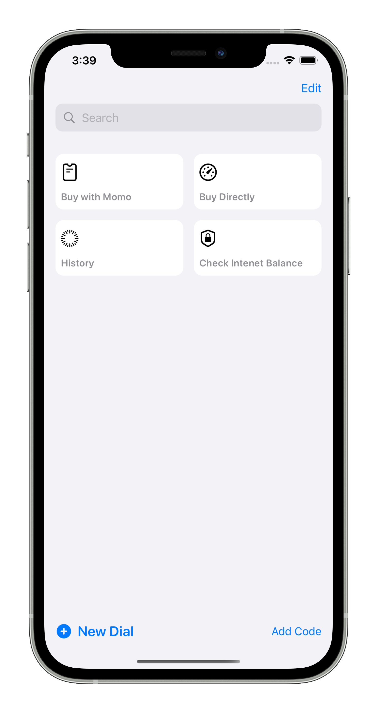
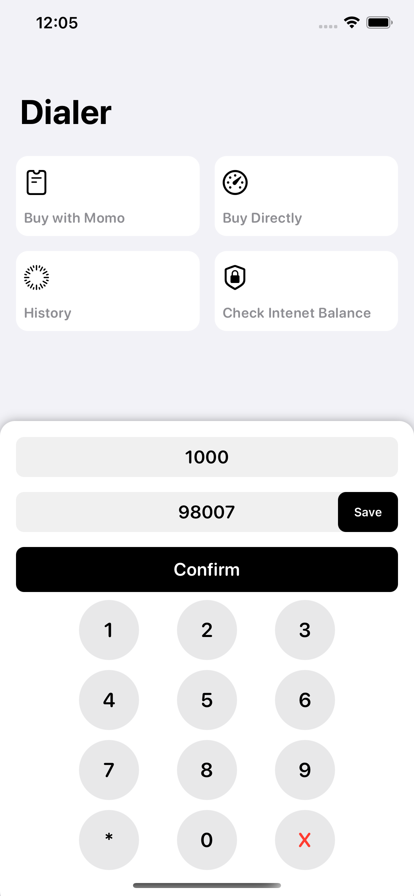
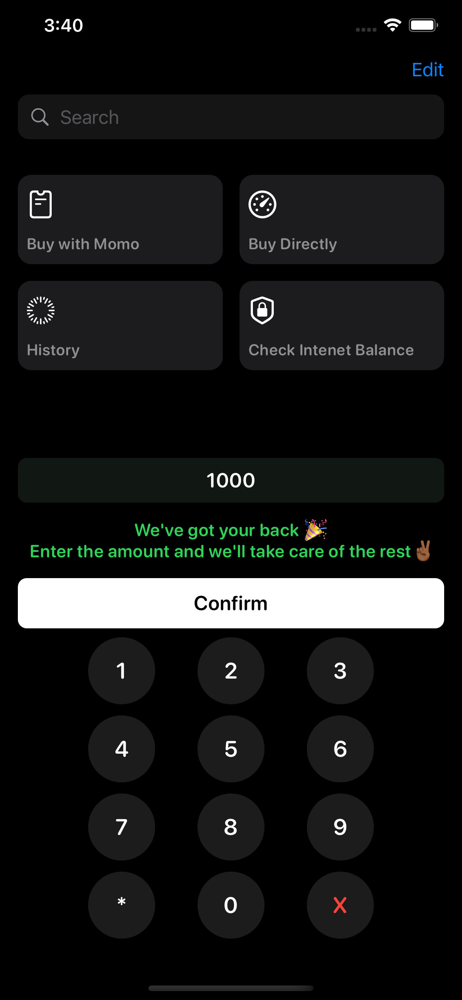

# dialer
# Made with ❤️ and ``SwiftUI``.

## Version 1.0:

### A intuitive USSD client to handle most of the common actions for you
### Contains common MTN Rwanda USSD activation codes, which drastically simplifies the time to activate those packages. 

## Version 1.1:
### Improved Layout wiht dark mode support.
### Add History View to Track Past events.

&nbsp;&nbsp;&nbsp;&nbsp;

## ✨ Upcoming features:

### - Good Local Storage (Core Data)
### - Siri Commands Support (Intents and IntentsUI)
### - Better Pin Code UI with advanced functionalities (dial custom codes, etc).

