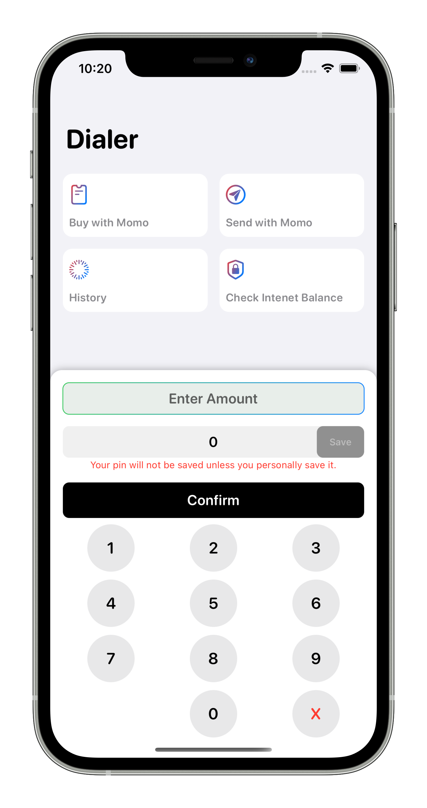
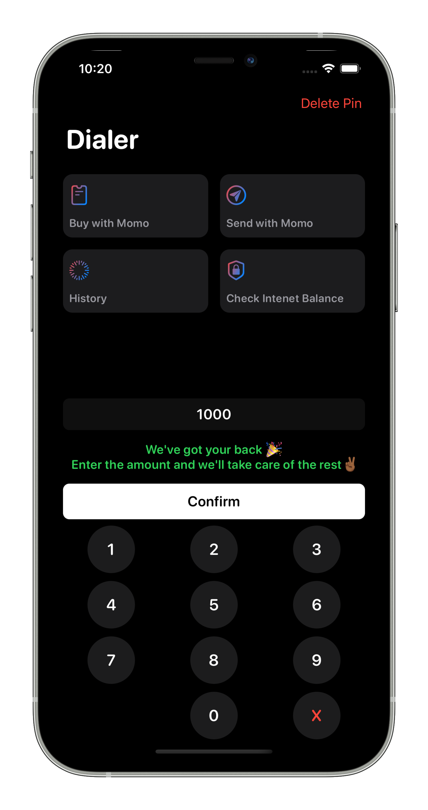
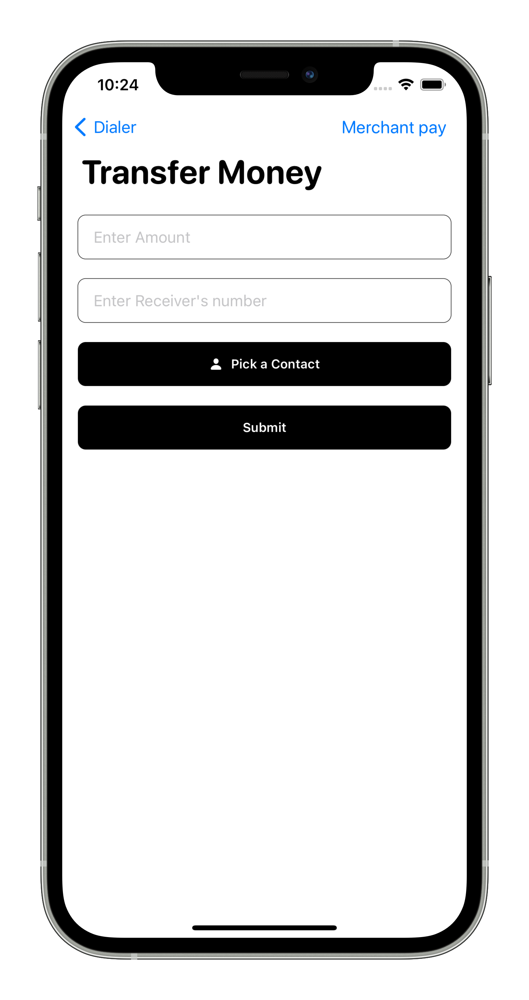
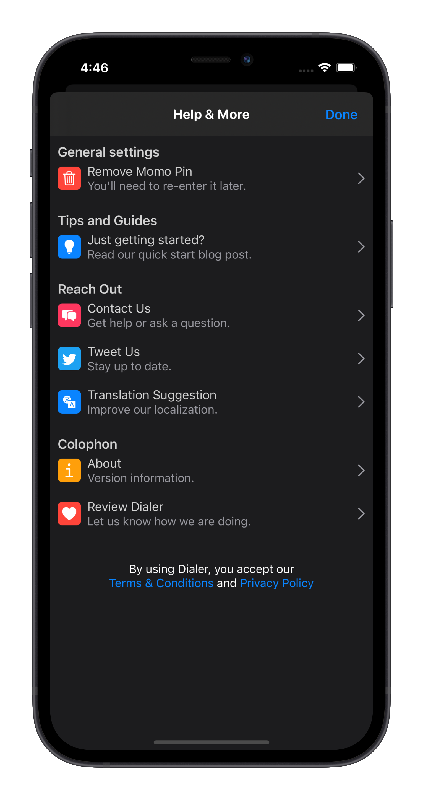
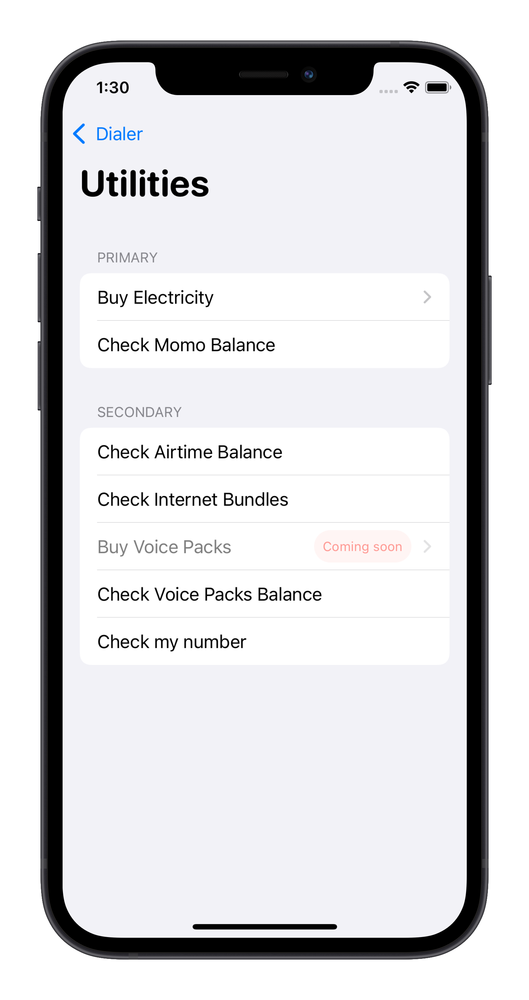
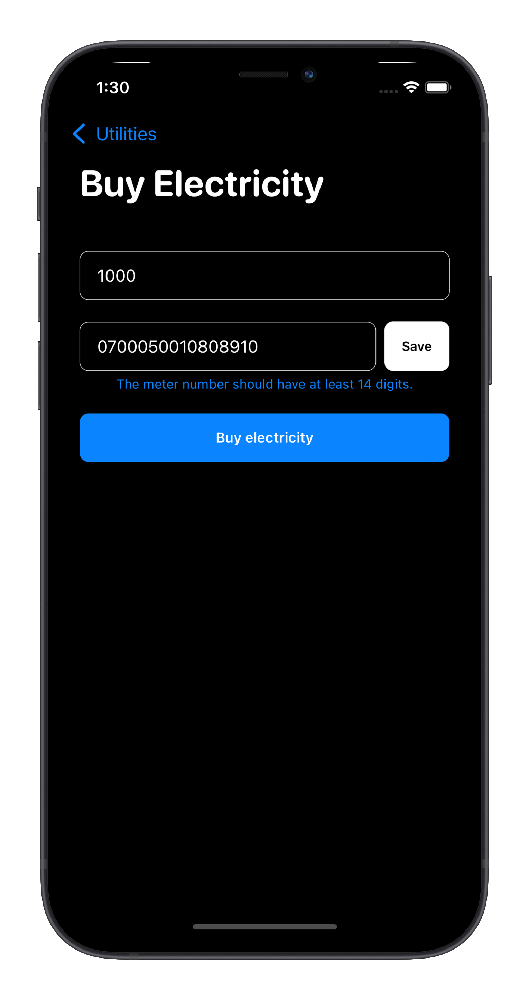

# Dialer

### An intuitive USSD client to handle most of the common actions for you.
### Access Rwanda Network providers USSD codes, and simplify packages activation nightmare.
Download it on [AppStore](https://apps.apple.com/ke/app/dial-it/id1591756747).

## ✅ Dones:
* Beautiful UI with Light/Dark Mode support.
* History View to Track Past dialings.
* Incognito mode for dialings (No track will be stored).
* Home Screen Quick Actions.
* Quick MTN Momo transfer (Client and Merchant support).
* Contacts Filtering.
* Settings
* Transaction Amount Limit 

## ✨ TODOs :

* Good Local Storage (Core Data)
* Siri Commands Support (Intents and IntentsUI)
* Transaction History

## TakeAways 🚀

- What makes a great app!
- SDLC(Software Development Life Cycle) in practice
- Following Apple Human Interface Guidelines (HIG)
- Deep Dive into Home Screen Quick Actions
- Local DataBase Management at Scale in iOS

## Technology 🧑🏽‍💻 
- SwiftUI & UIKit
- UserNotifications & LocalAuthentication
- StoreKit
- Contacts & CoreTelephony
- XCTest

## Screenshots

Home Light                 |  Home Dark
:-------------------------:|:-------------------------:
  |  

Transfer                    |  Settings
:-------------------------:|:-------------------------:
  |  

Utilities                  |  Electricity Payment
:-------------------------:|:-------------------------:
  |  

## Contributing

- PRs are very welcome!✨

## Authors

* **Cedric Bahirwe** - *iOS Engineer* - [cedricbahirwe](https://github.com/cedricbahirwe)
