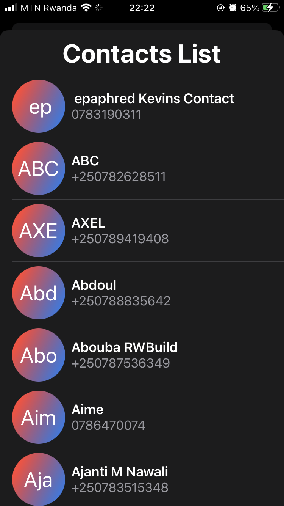

# Dialer
# Made with  `SwiftUI` and ❤️.

## Version 1.1:

### A intuitive USSD client to handle most of the common actions for you
### Contains common MTN Rwanda USSD activation codes, which drastically simplifies the time to activate those packages. 

## Features:
* ### Beautiful UI with Light/Dark Mode support.
* ### History View to Track Past dialings.
* ### Pin Interface for custom incognito dialings (No track will be stored).
* ### Home Screen Quick Actions.
* ### Quick Momo Money transfer (Client and Merchant upport).
* ### Contacts Filtering.

## TakeAways 🚀
- **Deep Dive into Home Screen Quick Actions Actions**
- **Respect of Apple Human Interface Guidelines**
- **Management of Local Storage in SwiftUI**

Home Light                 |  Home Dark
:-------------------------:|:-------------------------:
  |  

Tranfer                    |  Contacts
:-------------------------:|:-------------------------:
  |  
## ✨ Upcoming features:

* ### Good Local Storage (Core Data)
* ### Siri Commands Support (Intents and IntentsUI)
* ###  Transaction History
