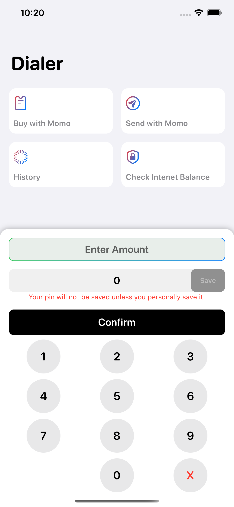
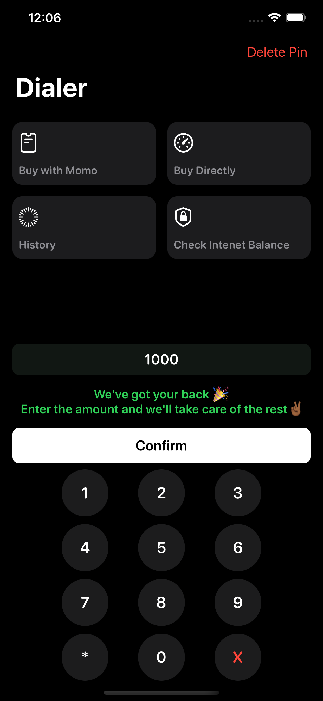
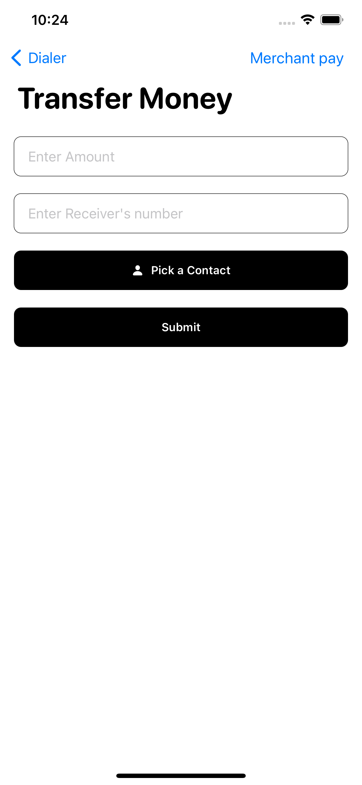
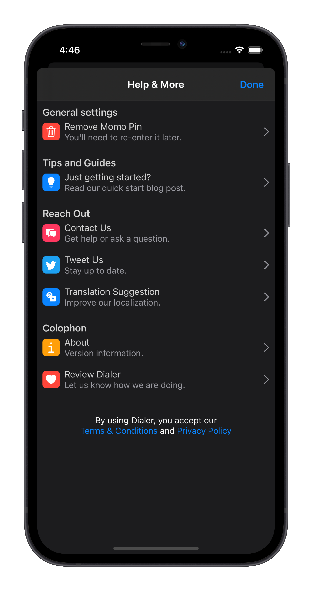
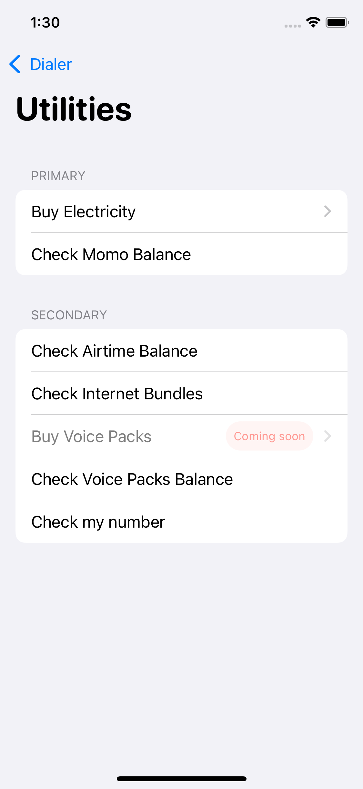
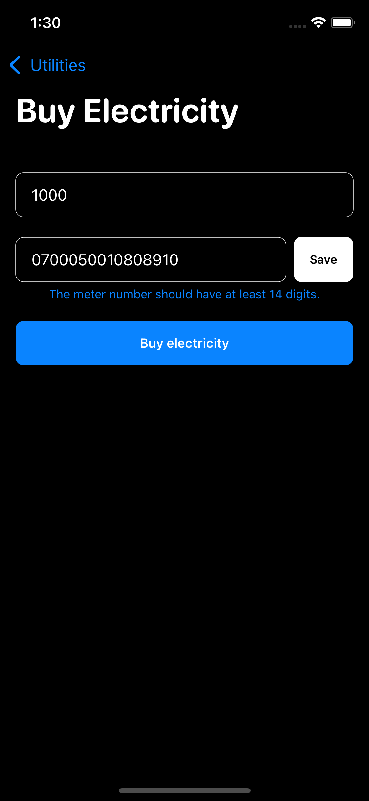

# Dialer

### An intuitive USSD client to handle most of the common actions for you.
### Contains common MTN Rwanda USSD activation codes, which drastically simplifies the time complexity to activate those packages. 

## Features:
* ### Beautiful UI with Light/Dark Mode support.
* ### History View to Track Past dialings.
* ### Incognito mode for dialings (No track will be stored).
* ### Home Screen Quick Actions.
* ### Quick MTN Momo transfer (Client and Merchant support).
* ### Contacts Filtering.
* ### Settings
* ### Transaction Amount Limit 

## TakeAways 🚀

- **Understand what makes a great app**
- **Understand the SDLC (Software Development Life Cycle)**
- **Following Apple Human Interface Guidelines**
- **Deep Dive into Home Screen Quick Actions Actions**
- **Management of Local DataBase in SwiftUI**
- **Light / Dark Mode Support**

## Special Thanks to:

1. [Esther Carelle](https://github.com/esthcarelle) for her feedback✨.

Home Light                 |  Home Dark
:-------------------------:|:-------------------------:
  |  

Transfer                    |  Settings
:-------------------------:|:-------------------------:
  |  

Utilities                  |  Electricity Payment
:-------------------------:|:-------------------------:
  |  
## ✨ Upcoming features:

* ### Good Local Storage (Core Data)
* ### Siri Commands Support (Intents and IntentsUI)
* ### Transaction History
